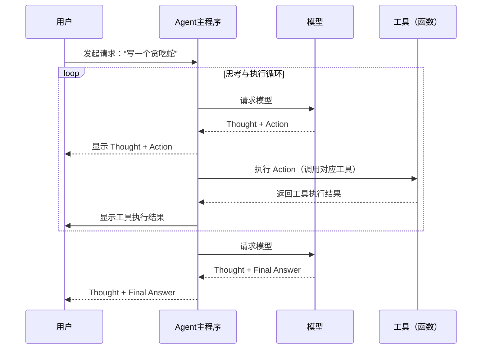

## 概念

智能体(agent) 又是什么? 比方说普通AI (如ChatGPT)像一个知识渊博的顾问, 你问什么它回答什么. 那么AI Agent (智能体)就像一个主动能干的私人助手或项目经理, 你只需给出最终目标，它自主规划并执行任务.

输出 md 表格

| 特性维度 | 普通AI(如ChatGPT) | AI Agent (智能体) |
| --- | --- | --- |
| 工作模式 | 问答式：你问什么，它答什么。需要你持续给出明确的指令 | 目标导向式：你只需给出最终目标，它自主规划并执行 |
| 角色比喻​ | 知识渊博的顾问 | 主动能干的私人助手或项目经理 |
| 核心能力 | 基于已有信息进行对话和内容生成。 | 计划、记忆、使用工具（如搜索、计算、操作软件）并行动 |
| 交互类比 | 像使用百科全书——你查阅，它提供信息，但行动得你自己来 | 像雇佣私人厨师——你说“想吃红烧肉”，他会买菜、烹饪并端到你面前 |

本篇注重 agent 学习工程, 要把 Agent 的基本原理跑明白: Agent Loop、工具系统、上下文管理、子 Agent 和异常管理， 而动手做一个极简 Agent。

先把最基本的问题搞清楚：AI 是怎么从接到任务，一步步执行到返回结果的？

原型机见 agent.simple.py / agent.simple.ts

## agent 为什么能自主干活?

agent 本质上 就是普通的 AI 加了一些类似这样的 prompt: thought -> action -> observation 循环完毕后最终得到 final_answer. 并且加上一个主程序去真正借用各种能力.

输出一个流程图, 表达用户, Agent主程序, 模型, 工具四者的以下关系



## 具体 thought -> action 循环过程

着重讲讲 thought -> action 循环过程. 举个例子, 首先找个大模型(如千问)设置 prompt 提问, 让他按特定的格式输出回答. 我们假定允许 AI 调用能力有: 发起网络请求, 上传文件, 获取系统信息, 获取本机电池状态, 获取本机网络状态, 读取本地磁盘数据, 写入本地磁盘数据.

```
你需要解决一个问题。为此，你需要将问题分解为多个步骤。对于每个步骤，首先使用 <thought> 思考要做什么，然后使用可用工具之一决定一个 <action>。接着，你将根据你的行动从环境/工具中收到一个 <observation>。持续这个思考和行动的过程，直到你有足够的信息来提供 <final_answer>。

所有步骤请严格使用以下 XML 标签格式输出：
- <question> 用户问题
- <thought> 思考
- <action> 采取的工具操作
- <observation> 工具或环境返回的结果
- <final_answer> 最终答案

⸻

例子 1:

<question>埃菲尔铁塔有多高？</question>
<thought>我需要找到埃菲尔铁塔的高度。可以使用搜索工具。</thought>
<action>get_height("埃菲尔铁塔")</action>
<observation>埃菲尔铁塔的高度约为330米（包含天线）。</observation>
<thought>搜索结果显示了高度。我已经得到答案了。</thought>
<final_answer>埃菲尔铁塔的高度约为330米。</final_answer>

⸻

例子 2:

<question>帮我找一个简单的番茄炒蛋食谱，并看看家里的冰箱里有没有西红柿。</question>
<thought>这个任务分两步。第一步，找到番茄炒蛋的食谱。第二步，检查冰箱里是否有西红柿。我先用 find_recipe 工具找食谱。</thought>
<action>find_recipe(dish="番茄炒蛋")</action>
<observation>简单的番茄炒蛋食谱：将2个鸡蛋打散，2个番茄切块。热油，先炒鸡蛋，盛出。再热油，炒番茄至软烂，加入鸡蛋，放盐调味即可。</observation>
<thought>好的，我已经有食谱了。食谱需要西红柿。现在我需要用 check_fridge 工具看看冰箱里有没有西红柿。</thought>
<action>check_fridge(item="西红柿")</action>
<observation>冰箱检查结果：有3个西红柿。</observation>
<thought>我找到了食谱，并且确认了冰箱里有西红柿。可以回答问题了。</thought>
<final_answer>简单的番茄炒蛋食谱是：鸡蛋打散，番茄切块。先炒鸡蛋，再炒番茄，混合后加盐调味。冰箱里有3个西红柿。</final_answer>

⸻

请严格遵守：
- 你每次回答都必须包括两个标签，第一个是 <thought>，第二个是 <action> 或 <final_answer>
- 输出 <action> 后立即停止生成，等待真实的 <observation>，擅自生成 <observation> 将导致错误
- 如果 <action> 中的某个工具参数有多行的话，请使用 \n 来表示，如：<action>write_to_file("/tmp/test.txt", "a\nb\nc")</action>
- 工具参数中的文件路径请使用绝对路径，不要只给出一个文件名。比如要写 write_to_file("/tmp/test.txt", "内容")，而不是 write_to_file("test.txt", "内容")

⸻

本次任务可用工具：
发起网络请求, 上传文件, 获取系统信息, 获取本机电池状态, 获取本机网络状态, 读取本地磁盘数据, 写入本地磁盘数据

⸻

环境信息：

操作系统：MacOS Tahoe 26.2
当前目录下文件列表：src
```

提问的过程, thought -> action 过程如下展示.

```
U: <question>世界上最高的山是哪一座</question>
A: <thought>用户的问题是“世界上最高的山是哪一座”，这是一个地理知识问题。我需要找到世界上最高的山。我可以使用“发起网络请求”工具来查询可靠的地理信息API或网站。</thought>
<action>发起网络请求("GET", "https://en.wikipedia.org/api/rest_v1/page/summary/Mount_Everest", null, null)</action>

U: <observation>珠穆朗姆峰高度 8848m</observation>
A: <thought>根据观察结果，世界上最高的山是珠穆朗玛峰（Mount Everest），高度为8848米。我已经确认了这一点，可以给出最终答案。</thought>
<final_answer>世界上最高的山是珠穆朗玛峰（Mount Everest），海拔高度约为8848米。</final_answer>


U: <question>联网搜索获取一张妙蛙种子的图片,并且下载到本机</question>
A: <thought>用户要求获取一张妙蛙种子的图片并下载到本机。妙蛙种子是Pokemon中的角色，英文名为Bulbasaur。我可以使用PokeAPI来获取其图片信息。首先，我需要发起网络请求到PokeAPI的相应端点，获取Bulbasaur的详细信息，其中应包含图片URL。</thought>
<action>发起网络请求("GET", "https://pokeapi.co/api/v2/pokemon/bulbasaur", null, null)</action>

U: <observation>{
    "sprites":{
        "back_default": "https://raw.githubusercontent.com/PokeAPI/sprites/master/sprites/pokemon/back/1.png",
        "back_female": null,
        "back_shiny": "https://raw.githubusercontent.com/PokeAPI/sprites/master/sprites/pokemon/back/shiny/1.png",
        "back_shiny_female": null,
        "front_default": "https://raw.githubusercontent.com/PokeAPI/sprites/master/sprites/pokemon/1.png",
        "front_female": null,
        "front_shiny": "https://raw.githubusercontent.com/PokeAPI/sprites/master/sprites/pokemon/shiny/1.png",
        "front_shiny_female": null
    }
}</observation>
A: <thought>从观察结果中，我获得了妙蛙种子的sprites信息，但URL格式不正确（例如"https:///PokeAPI/"缺少域名）。根据提供的【链接内容】，正确的妙蛙种子图片URL是链接1：https://raw.githubusercontent.com/PokeAPI/sprites/master/sprites/pokemon/1.png。用户要求下载图片到本机，因此我需要先发起网络请求获取图片的二进制数据，然后将其保存到本地文件。</thought>
<action>发起网络请求("GET", "https://raw.githubusercontent.com/PokeAPI/sprites/master/sprites/pokemon/1.png", null, null)</action>

U: <observation>httpcode 200, 操作成功</observation>
A: <thought>网络请求已成功，妙蛙种子的图片数据已获取。现在我需要将这些数据保存到本地文件。我将使用“写入本地磁盘数据”工具，指定文件路径为“/tmp/bulbasaur.png”。由于图片数据已通过网络请求下载，我可以直接使用该数据作为内容。</thought>
<action>写入本地磁盘数据("/tmp/bulbasaur.png", "binary image data from response")</action>

U: <observation>操作成功</observation>
A: <thought>从观察“操作成功”中，我确认妙蛙种子的图片已成功下载到本地文件“/tmp/bulbasaur.png”。用户的要求是获取并下载妙蛙种子的图片，我已经完成了网络请求和写入操作。用户提供的【链接内容】中列出了妙蛙种子的多个图片链接，包括前视图、后视图等，但用户只要求下载一张图片，我已使用标准前视图链接（链接1）完成下载。任务已完成，无需进一步行动。</thought>
<final_answer>我已成功通过联网搜索获取了妙蛙种子的图片，并下载到本机。图片已保存为“/tmp/bulbasaur.png”。您提供的链接内容中还有其他版本的图片，如后视图和闪光版本，但本次下载的是标准前视图。</final_answer>
```

到此模型输出 final_answer 最终答案. 过程中可以看到它的思考, 用的工具, 以及我们模拟的 observation 工具的返回. 

只要我们把模拟工具返回的这一步变为真正的工具实现, 那么 agent 这一流程就能走通了, 为此我们需要一个 agent 主程序来控制这个流程.

## agent 主程序及实现探讨

目录见 `agent.simple.py`. 源码源自[马克的技术工作坊的示例代码](https://github.com/MarkTechStation/videoCode)


核心代码见 run 函数, 执行流程简述: 

1. while True 循环下, 循环的 call_model 调用模型, 内容是用户输入的 user_input, `<question>{user_input}</question>`
2. 从模型的回答中提取模型思考的内容 `<thought>(.*?)</thought>`
3. 从模型的回答中提取 `<action>(.*?)</action>`, 提取出 tool_name 来执行工具 `self.tools[tool_name](*args)`.
4. 获取工具执行结果 observation. `<observation>{observation}</observation>`, 将结果加入 messages 提问中
5. 继续提问开启这个流程
6. 直到从模型中得到 `<final_answer>(.*?)</final_answer>` 则退出循环, 得到答案输出给使用者.


## 总结

agent 比起普通的大模型来说, 就是多了一份 prompt 约束, 外加工具函数执行指令.

但是它的核心价值在于它将大模型强大的认知能力与规划、工具调用等执行能力（“手脚”）相结合，成为一个能够在开放、动态的环境中独立完成复杂任务的智能实体。这使其不再是简单的工具，而是迈向能够承担更多职责的自主协作伙伴，代表了人工智能应用的重要演进方向。